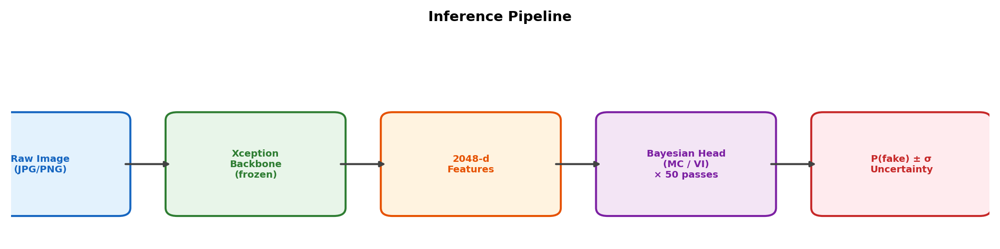
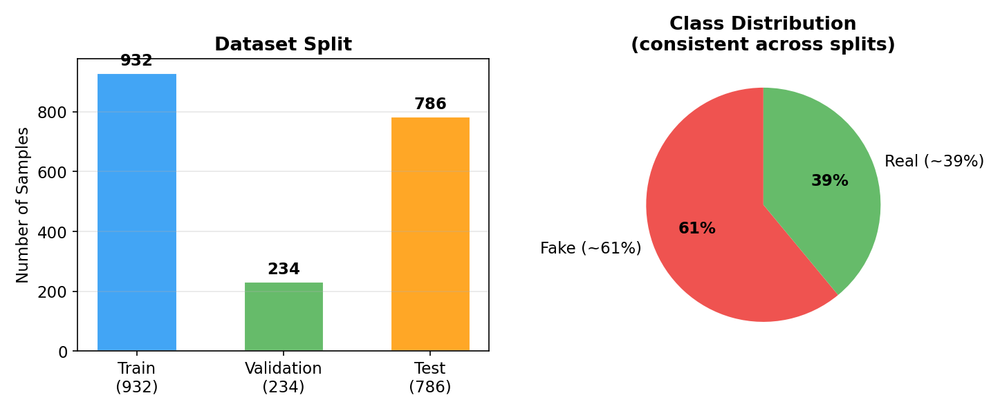
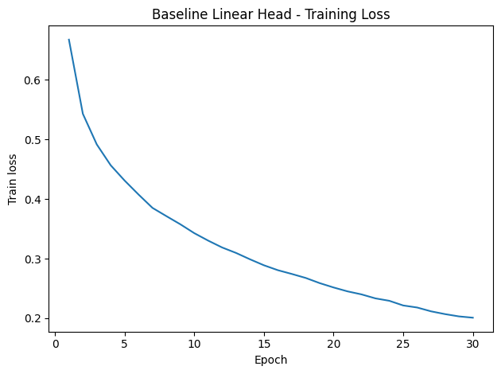
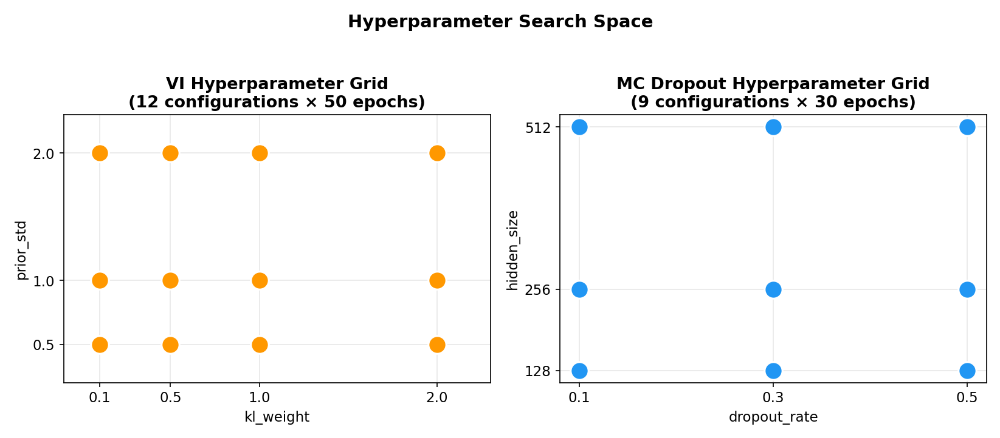
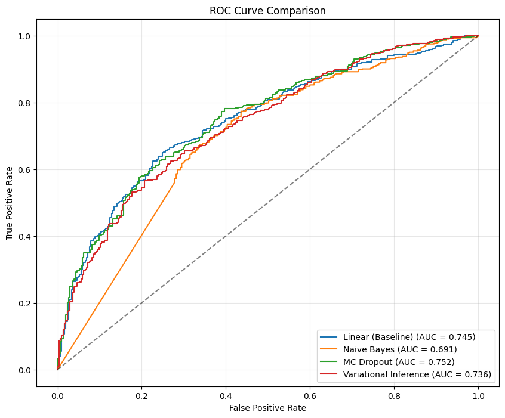
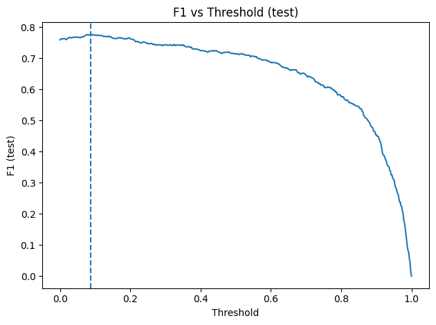
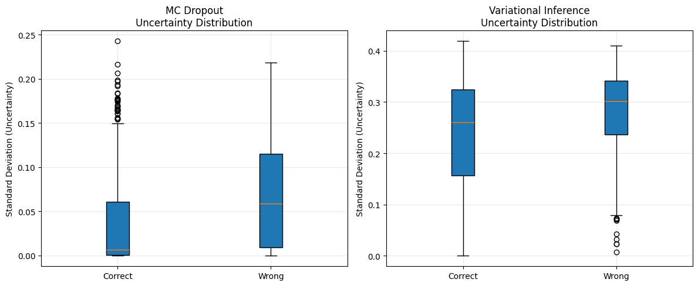
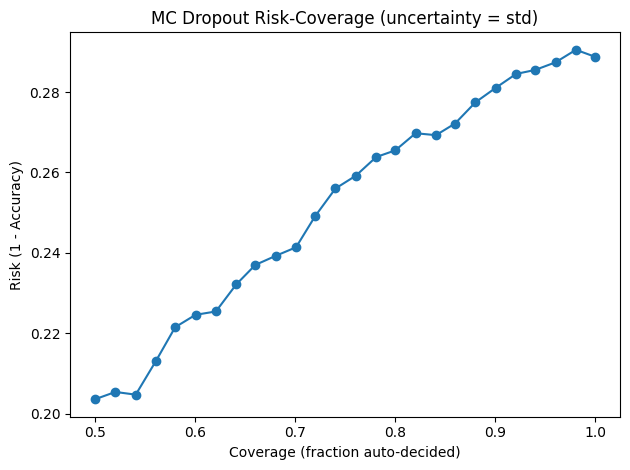
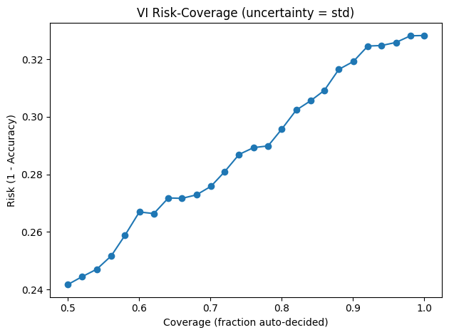
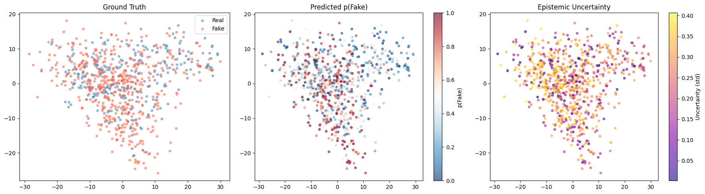

# Deepfake Detection with Bayesian Uncertainty Quantification

**Live Demo:** [Open the app](https://test-bayesian-detection.streamlit.app/)

## Project Overview
This project applies Bayesian Machine Learning to deepfake image detection, going beyond simple binary classification by providing calibrated uncertainty estimates for every prediction. Instead of only answering whether an image is fake or real, the system also indicates when the model is uncertain, supporting safer decision-making in high-stakes settings.

## Why This Matters
Traditional deepfake detectors usually output a hard label or a single probability score, but they do not tell users how much to trust that prediction. In domains such as journalism, legal forensics, and content moderation, a confident wrong answer can be more harmful than an honest "I’m not sure." This project explores whether Bayesian approaches can improve uncertainty awareness in deepfake detection.

## My Contribution
- Contributed to model evaluation and uncertainty-analysis workflow
- Helped organize result interpretation across baseline and Bayesian models
- Supported README/chart structuring for portfolio-facing presentation
- Contributed to framing deployment-oriented insights such as reject option and human-in-the-loop usage

## Team Attribution
This repository is a cleaned personal portfolio version of a team project completed collaboratively with Anais Morales, Gaoyuan Gu, and Khalil He. This version is organized to highlight the project methodology, evaluation results, demo, and my specific contributions.


---
## Future Expansion
- More Data for Robustness
- A video-level pipeline
- A deployable product surface
- Human-in-the-loop + monitoring

---

## Project Pipeline



---

## Data & Feature Extraction

- **Dataset:** DeepfakeEval2024 — 1,952 curated images after cleaning
- **Split:** 932 train / 234 validation / 786 test (stratified)
- **Class balance:** ~61% fake, ~39% real (consistent across splits)
- **Backbone:** ImageNet-pretrained **Xception** via `timm`, frozen as feature extractor
- **Preprocessing:** Resize(342) → CenterCrop(299) → ImageNet normalization
- **Output:** 2,048-dimensional feature vector per image



---

## Model Architectures

### Overview

| Model | Type | Uncertainty? | Description |
|-------|------|:------------:|-------------|
| **Linear Head** | Deterministic baseline | No | Single linear layer + sigmoid |
| **Naive Bayes** | Generative baseline | No | Gaussian Naive Bayes on 2048-d features |
| **MC Dropout** | Bayesian approximation | Yes | MLP with dropout active at inference |
| **Variational Inference** | Full Bayesian | Yes | Learned posterior over weights |

### MC Dropout — Architecture & Theory

```
Input (2048-d)
    │
    ▼
┌──────────────────┐
│  Linear(2048→256) │
│  ReLU             │
│  Dropout(p=0.3)   │  ◀── Kept ON at inference (key insight)
│  Linear(256→1)    │
│  Sigmoid          │
└──────────────────┘
    │
    ▼ × 50 forward passes
    │
  mean(p), std(p)
```

**Core idea:** Dropout at test time approximates a Bayesian posterior (Gal & Ghahramani, 2016). Each forward pass samples a different sub-network, and the variance across passes reflects model uncertainty.

### Variational Inference — Architecture & Theory

```
Input (2048-d)
    │
    ▼
┌──────────────────────────────────────┐
│  BayesianLinear(2048→1)              │
│                                      │
│  Each weight w ~ N(μ, softplus(ρ)²)  │
│  Prior: N(0, 0.5²)                   │
│                                      │
│  Reparameterization trick:           │
│  w = μ + softplus(ρ) × ε,  ε ~ N(0,1)│
└──────────────────────────────────────┘
    │
    ▼ × 50 forward passes
    │
  mean(p), std(p)

Training Loss = ELBO = NLL(BCE) + KL(q(w) ‖ p(w))
```

**Core idea:** Instead of learning point-estimate weights, we learn a **distribution** (μ, ρ) for each weight. The KL divergence term regularizes toward the prior, preventing overfitting while maintaining calibrated uncertainty.

---

## Model Training

### Training Configuration

| Parameter | Linear Head | Naive Bayes | MC Dropout | VI |
|-----------|:-----------:|:-----------:|:----------:|:--:|
| Epochs | 30 | — | 30 | 50 |
| Optimizer | Adam | — | Adam | Adam |
| Learning Rate | 1e-3 | — | 1e-3 | 1e-3 |
| Weight Decay | 1e-4 | — | 1e-4 | — |
| Batch Size | 128 | — | 128 | 128 |
| Loss Function | BCE | — | BCE | ELBO (BCE + KL) |
| Random Seed | — | — | 114514 | 114514 |

### Training Convergence

**Linear Baseline** — Training loss over 30 epochs:



**MC Dropout** — Rapid convergence, loss 0.6277 → 0.0019 in 30 epochs:

| Epoch | 1 | 5 | 10 | 15 | 20 | 25 | 30 |
|-------|---|---|----|----|----|----|-----|
| Loss | 0.6277 | 0.1141 | 0.0215 | 0.0075 | 0.0037 | 0.0024 | **0.0019** |

**VI** — Smoother decrease, ELBO 9.15 → 7.48 in 50 epochs (higher absolute value due to KL term):

| Epoch | 1 | 10 | 20 | 30 | 40 | 50 |
|-------|---|----|----|----|----|-----|
| ELBO | 9.148 | 8.551 | 8.311 | 8.029 | 7.804 | **7.475** |

**Domain shift observed:** Linear baseline train AUC ≈ 0.994 vs test AUC ≈ 0.729 — a significant gap indicating distribution shift between train and test sets.

---

## Hyperparameter Optimization

### VI Hyperparameter Grid Search

Searched over **12 configurations** (50 epochs each, evaluated on validation AUC with 50 MC samples):

| Parameter | Search Space |
|-----------|-------------|
| `kl_weight` | [0.1, 0.5, 1.0, 2.0] |
| `prior_std` | [0.5, 1.0, 2.0] |

**Trade-off:** Higher `kl_weight` → stronger regularization → more conservative predictions, higher uncertainty. Lower `kl_weight` → closer to deterministic model, better fit but risk of overconfidence.

### MC Dropout Hyperparameter Grid Search

Searched over **9 configurations** (30 epochs each, evaluated on validation AUC with 20 MC samples):

| Parameter | Search Space |
|-----------|-------------|
| `dropout_rate` | [0.1, 0.3, 0.5] |
| `hidden_size` | [128, 256, 512] |

**Trade-off:** Higher dropout → more stochasticity → broader uncertainty estimates but potential under-fitting. Larger hidden layer → more capacity but slower inference.



---

## Results

### ROC Curve Comparison (All Models)



### Performance Comparison (F1-Optimized Thresholds)

| Model | Threshold | AUC | Accuracy | F1 | Recall | Precision | Unc. Gap |
|-------|:---------:|:---:|:--------:|:--:|:------:|:---------:|:--------:|
| **VI** | 0.112 | 0.736 | 0.677 | **0.782** | 0.946 | 0.666 | +0.050 |
| **MC Dropout** | 0.015 | **0.752** | 0.679 | **0.782** | 0.938 | 0.670 | +0.021 |
| Linear | 0.148 | 0.745 | 0.681 | 0.774 | 0.894 | 0.683 | — |
| Naive Bayes | 0.000 | 0.691 | 0.612 | 0.759 | 1.000 | 0.612 | — |

**Linear Baseline — F1 vs Threshold curve:**



### Performance Comparison (Accuracy-Optimized Thresholds)

| Model | Threshold | AUC | Accuracy | F1 | Recall | Precision |
|-------|:---------:|:---:|:--------:|:--:|:------:|:---------:|
| **MC Dropout** | 0.516 | **0.752** | **0.712** | 0.769 | 0.782 | 0.757 |
| Linear | 0.337 | 0.745 | 0.693 | 0.755 | 0.771 | 0.739 |
| **VI** | 0.204 | 0.736 | 0.686 | 0.776 | 0.888 | 0.689 |
| Naive Bayes | 0.001 | 0.691 | 0.672 | 0.726 | 0.709 | 0.743 |

### Uncertainty Quality Analysis

The key advantage of Bayesian models — **wrong predictions carry higher uncertainty**:



| Metric | MC Dropout | VI |
|--------|:----------:|:--:|
| Mean std (correct) | 0.042 | 0.234 |
| Mean std (wrong) | 0.063 | 0.284 |
| Uncertainty Gap (wrong − correct) | +0.021 | **+0.050** |
| Error-Detection AUROC | **0.643** | 0.636 |
| AURC (lower = better) | **0.126** | 0.144 |

### Reject Option — Selective Prediction

By rejecting the most uncertain predictions, accuracy improves on the remaining samples:

| | MC Dropout | | VI | |
|:-----------:|:---------:|:----:|:----:|:---:|
| **Reject Rate** | **Acc** | **F1** | **Acc** | **F1** |
| 0% (all) | 0.711 | 0.768 | 0.672 | 0.709 |
| 5% | 0.714 | 0.771 | 0.672 | 0.710 |
| 10% | 0.719 | 0.776 | 0.681 | 0.718 |
| **20%** | **0.734** | **0.794** | **0.704** | **0.740** |

Rejecting the top 20% most uncertain samples improves MC Dropout accuracy by **+2.3pp** and F1 by **+2.6pp**.

**MC Dropout — Risk-Coverage Curve:**



**VI — Risk-Coverage Curve:**



### Latent Space Visualization (PCA)

VI model's predictions and uncertainty projected onto the first 2 principal components of the 2048-d feature space:



*Left: ground-truth labels | Center: predicted P(fake) | Right: epistemic uncertainty (std) — high-uncertainty points cluster near the decision boundary.*

---

## Interactive Demo

A **Streamlit** web application allows real-time inference with all trained models:

- Upload any image or select from built-in samples
- View **fake probability** and **uncertainty (std)** from each Bayesian model side-by-side
- Models toggle on/off from the sidebar
- Uncertainty is interpreted in plain language ("high uncertainty" vs. "confident")

### Run the Demo

```bash
# Install dependencies
pip install -r requirements.txt

# Launch the app
streamlit run test.py
```

Then open `http://localhost:8501` in your browser.

Or access our published link: `https://test-bayesian-detection.streamlit.app/`

---

## Project Structure

```
├── test.py                          # Streamlit demo application
├── requirements.txt                 # Python dependencies
├── generate_charts.py               # Script to regenerate README charts
├── assets/                          # Charts for README (from notebooks + script)
├── checkpoints/                     # Trained model weights (.pt)
│   ├── mc_dropout.pt
│   ├── bayesian_linear.pt
│   └── variational_inference.pt
├── sample_pics/                     # Sample images for demo
├── notebooks/
│   ├── Model_Building.ipynb         # EDA, feature extraction, training & hyperparameter search
│   └── Model_Valuation.ipynb        # Comprehensive evaluation & model comparison
└── .devcontainer/                   # Dev container configuration
```

---

## Dependencies

- PyTorch + torchvision
- timm (Xception backbone)
- Streamlit (interactive demo)
- scikit-learn, NumPy, Pandas, Matplotlib
- OpenCV, Pillow, facenet-pytorch
